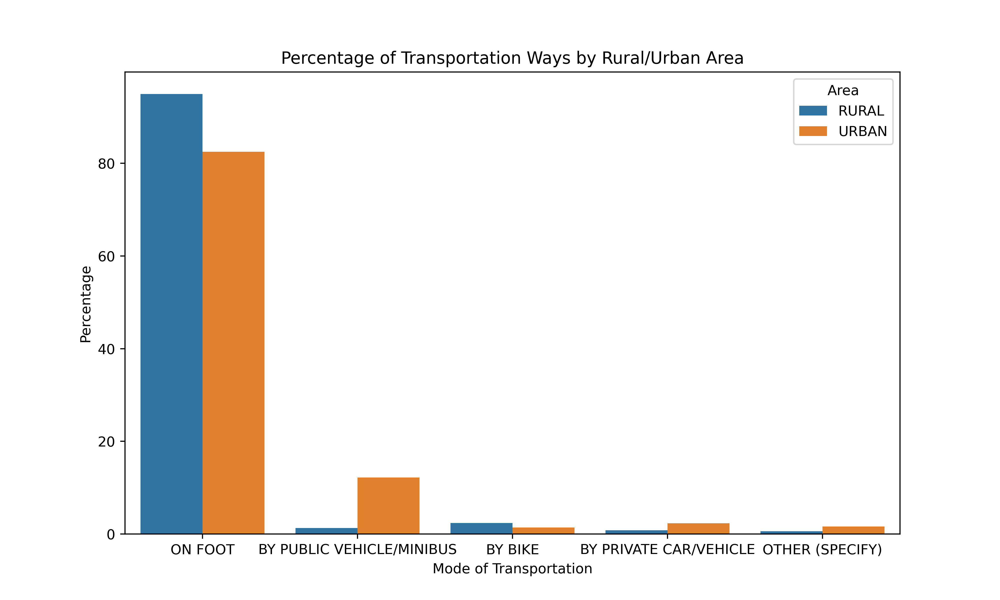
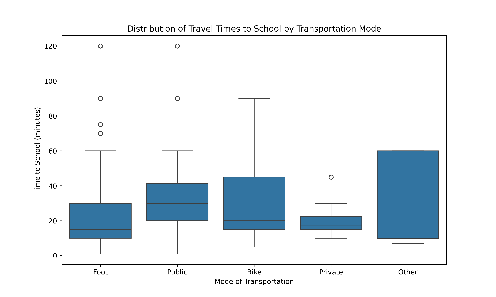

# Student Transportation Analysis in Tanzania

## Data Source
This analysis is based on the [National Panel Survey 2019-2020 - Extended Panel with Sex Disaggregated Data](https://microdata.worldbank.org/index.php/catalog/3885), specifically datasets HH_SEC_A and HH_SEC_C.

## Objective
Our research examines transportation modes and commute times to school for over 1200 students in Tanzania, spanning various regions and districts. The study highlights the differences in transportation accessibility between rural and urban settings and the impact on students' school attendance.

## Dataset Summary
The dataset includes detailed information about each student's living area (rural or urban), geographical region, district, mode of transportation to school, and the duration of their commute.

### Sample Data Snippet
```csv
sdd_hhid     ,sdd_rural ,t0_region   ,t0_district   ,hh_c14    ,hh_c15
0003-001-001 ,RURAL     ,DODOMA      ,KONDOA        ,BY BIKE   ,45.0
0004-001-001 ,RURAL     ,PWANI       ,MKURANGA      ,ON FOOT   ,30.0
0005-001-001 ,RURAL     ,DODOMA      ,KONDOA        ,BY BIKE   ,60.0
0005-001-001 ,RURAL     ,DODOMA      ,KONDOA        ,ON FOOT   ,7.0
0005-001-001 ,RURAL     ,DODOMA      ,KONDOA        ,ON FOOT   ,7.0
```
## Visualizations

We have created two charts to visualize our findings on transportation modes and travel times to school:




## Insights
The visualizations demonstrate a significant disparity in transportation options between rural and urban students. Walking is the predominant mode of transportation in rural areas, often resulting in longer travel times that could potentially affect students' ability to consistently attend school on time. These findings suggest a need for infrastructure improvements to provide safer and more efficient transportation options for students, particularly in rural areas.